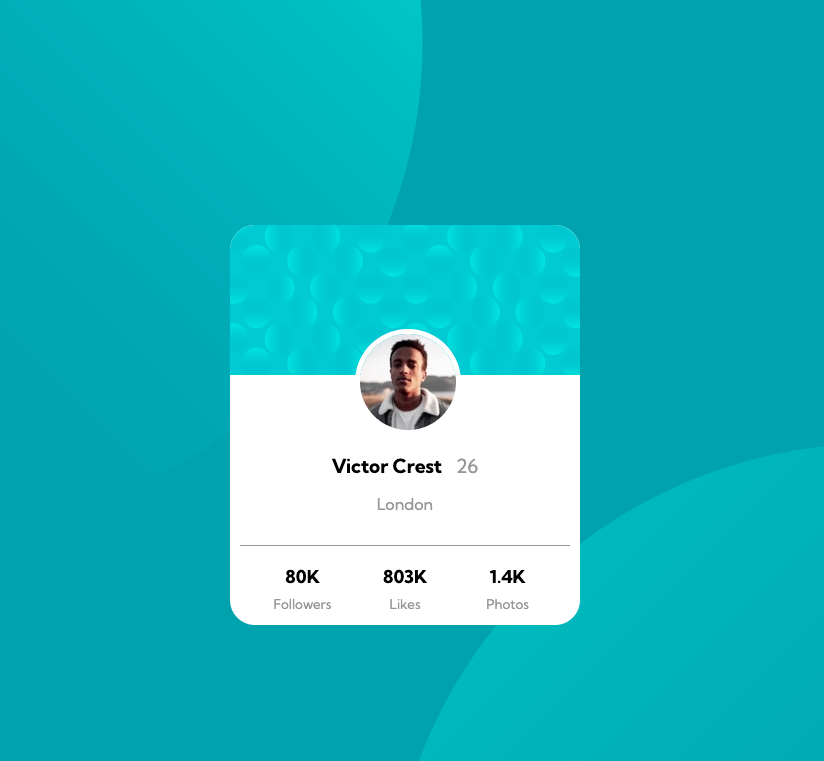

# Frontend Mentor - Profile card component solution

This is a solution to the [Profile card component challenge on Frontend Mentor](https://www.frontendmentor.io/challenges/profile-card-component-cfArpWshJ). Frontend Mentor challenges help you improve your coding skills by building realistic projects. 

## Table of contents

- [Overview](#overview)
  - [The challenge](#the-challenge)
  - [Screenshot](#screenshot)
  - [Links](#links)
- [My process](#my-process)
  - [Built with](#built-with)
  - [What I learned](#what-i-learned)
  - [Continued development](#continued-development)
  - [Useful resources](#useful-resources)
- [Author](#author)

## Overview

### The challenge

- Build out the project to the designs provided by Frontend Mentor.

### Screenshot

### Links

- Solution URL: [https://github.com/UnknownBuilder/FEmentor_profile-card](https://github.com/UnknownBuilder/FEmentor_profile-card)
- Live Site URL: [https://unknownbuilder.github.io/FEmentor_profile-card/](https://unknownbuilder.github.io/FEmentor_profile-card/)

## My process

### Built with

- HTML
- CSS

### What I learned

I familiarized myself with the box model (padding, margin, borders, etc.) as well as image and element positining. 

I also started to understand a bit better why people might use things like SaSS, frameworks, and libraries to do their CSS. I couldn't believe just how much code I wrote for something so basic. I'm terrified to think what a complex app would look like with pure CSS. 

### Continued development

- When doing this challenge I started to think that there has to be an easier way to do the CSS. I couldn't believe how much code was needed to get such a simple result. 

I suppose, this is why frameworks like Boostrap and Tailwind CSS exist. I'll look into these and other technologies to see what benefits I can extract from them. 

However, I'll continue to use pure CSS until I'm sick of it as I want learn the fundamentals of the technologies that power the web. Wouldn't want to end up a  . 😅

### Useful resources

- For this project I used nothing but Google to figure out the things that I didn't know how to do.

- Below websites were very useful and came up frequently when I googled stuff. 
1. w3schools.com
2. developer.mozilla.org

## Author

- Still a newb but I'm getting better, I think 😬. 
